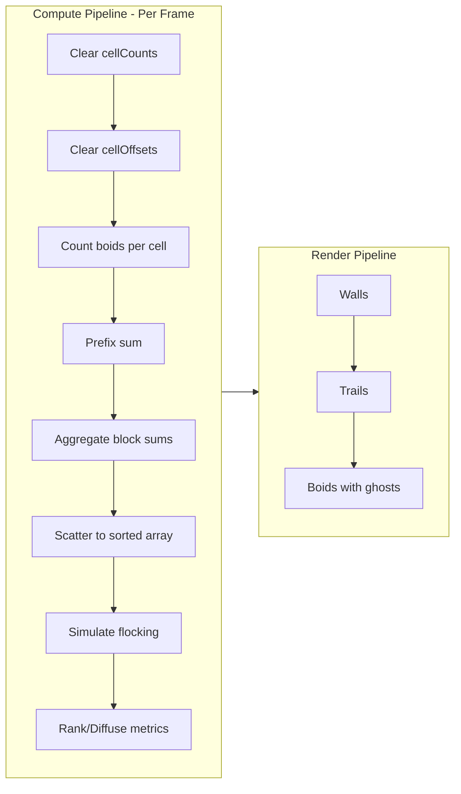
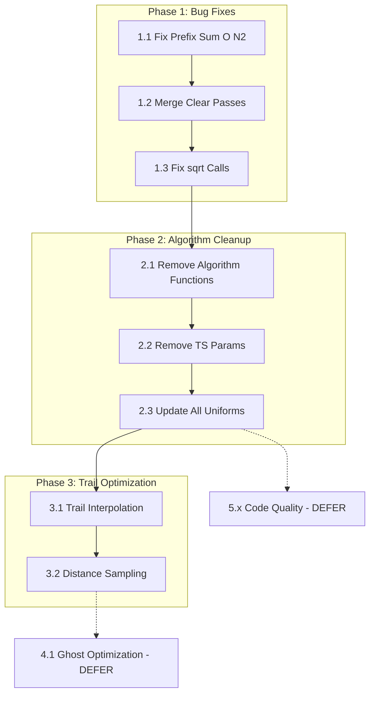

# Boid Simulation Performance Optimization Plan

## Architecture Overview

This is a WebGPU-based boid flocking simulation built with SvelteKit. Understanding the compute pipeline is critical:



### Key Files Structure

```
src/lib/
├── webgpu/
│   ├── simulation.ts    # Main loop orchestration
│   ├── compute.ts       # Compute pipeline setup, bind groups, encodeComputePasses()
│   ├── render.ts        # Render pipeline setup, encodeRenderPass()
│   ├── buffers.ts       # Buffer creation, updateUniforms(), MAX_TRAIL_LENGTH
│   └── types.ts         # TypeScript types, enums, SimulationParams, DEFAULT_PARAMS
├── shaders/
│   ├── simulate.wgsl    # MAIN: Flocking algorithms (2061 lines) - 5 algorithms, only HashFree used
│   ├── prefix_sum.wgsl  # Blelloch scan + aggregate (has O(N²) bug)
│   ├── count.wgsl       # Spatial hash counting
│   ├── scatter.wgsl     # Scatter boids to sorted array
│   ├── clear.wgsl       # Clear cellCounts (should merge with clear_offsets)
│   ├── clear_offsets.wgsl # Clear cellOffsets (DELETE after merge)
│   ├── boid.wgsl        # Boid rendering (840 lines)
│   ├── trail.wgsl       # Trail rendering (755 lines)
│   ├── wall.wgsl        # Wall rendering
│   ├── rank.wgsl        # PageRank-like influence
│   ├── diffuse.wgsl     # Feature diffusion
│   └── write_metrics.wgsl # Final metrics output
└── stores/
    └── simulation.ts    # Svelte stores (no algorithm params here)
```

### Critical Invariant: Uniform Buffer Layout

ALL 11 shader files contain an IDENTICAL `Uniforms` struct (48 fields, 256 bytes). When you modify the Uniforms struct, you MUST update ALL shaders in sync, plus `buffers.ts:updateUniforms()`.

Current Uniforms struct fields to REMOVE (lines 37-40 in all shaders):

```wgsl
algorithmMode: u32,      // REMOVE - always HashFree
kNeighbors: u32,         // REMOVE - only used by TopologicalKNN
sampleCount: u32,        // REMOVE - only used by Stochastic
idealDensity: f32,       // REMOVE - only used by DensityAdaptive
```

---

## Current State Analysis

The simulation uses **Hash-Free algorithm with locally perfect hashing** as confirmed by:

- `types.ts` line 431: `algorithmMode: AlgorithmMode.HashFree`
- The comment: "Hash-free with locally perfect hashing (best performance)"

However, 4 other unused algorithms still exist in `simulate.wgsl`:

- `algorithmTopologicalKNN()` - lines 769-923 (155 lines)
- `algorithmSmoothMetric()` - lines 929-1054 (126 lines)  
- `algorithmStochastic()` - lines 1190-1381 (192 lines)
- `algorithmDensityAdaptive()` - lines 1387-1522 (136 lines)

The algorithm selection switch (lines 1781-1788) is dead code since `algorithmMode` is always 2 (HashFree).

Key metrics from user testing:

- Neighbor counts: 20-40 in typical clusters
- Cell size = perception/2: **Keep this** - it intentionally reduces boundary artifacts
- Target: Personal computers, mobile, tablets (NOT gaming GPUs)
- Trail issue: Contracts when boids move slowly; user wants interpolation

---

## Phase 1: Critical Bug Fixes (High Impact, Low Risk)

### 1.1 Fix O(N²) Prefix Sum Aggregate

**Location**: `src/lib/shaders/prefix_sum.wgsl` lines 129-159

**Current buggy code** (each thread iterates ALL previous blocks):

```wgsl
@compute @workgroup_size(256)
fn addBlockSums(...) {
    // ...
    let originalBlock = idx / (WORKGROUP_SIZE * 2u);
    if (originalBlock == 0u) { return; }
    
    // BUG: O(N) per thread = O(N²) total
    var blockSum = 0u;
    for (var i = 0u; i < originalBlock; i++) {
        blockSum += blockSums[i];
    }
    prefixSums[idx] += blockSum;
}
```

**Fix approach**: Add a third entry point that pre-computes cumulative block sums:

```wgsl
// Add this new entry point
@compute @workgroup_size(1)
fn computeCumulativeBlockSums(@builtin(global_invocation_id) global_id: vec3<u32>) {
    // Run with 1 thread - blockSums array is small (typically <100 elements)
    let numBlocks = (uniforms.totalSlots + WORKGROUP_SIZE * 2u - 1u) / (WORKGROUP_SIZE * 2u);
    var sum = 0u;
    for (var i = 0u; i < numBlocks; i++) {
        let current = blockSums[i];
        blockSums[i] = sum;  // Convert to exclusive prefix
        sum += current;
    }
}

// Then modify addBlockSums to just do O(1) lookup:
@compute @workgroup_size(256)
fn addBlockSums(...) {
    let originalBlock = idx / (WORKGROUP_SIZE * 2u);
    if (originalBlock == 0u) { return; }
    prefixSums[idx] += blockSums[originalBlock];  // O(1) lookup!
}
```

**Files to modify**:

1. `src/lib/shaders/prefix_sum.wgsl` - Add `computeCumulativeBlockSums` entry point, simplify `addBlockSums`
2. `src/lib/webgpu/compute.ts`:

   - Add new pipeline for `computeCumulativeBlockSums`
   - In `encodeComputePasses()` around line 593, insert the new pass BETWEEN prefix sum and aggregate

**Testing**: This affects spatial hashing. Verify boids still flock correctly after change.

---

### 1.2 Merge Clear Passes

**Current state**: Two nearly identical shaders and passes:

- `clear.wgsl` clears `cellCounts` 
- `clear_offsets.wgsl` clears `cellOffsets`

Both are dispatched separately in `compute.ts` lines 557-571.

**Fix**: Merge into single shader with both buffers:

**Modified `clear.wgsl`**:

```wgsl
@group(0) @binding(0) var<uniform> uniforms: Uniforms;
@group(0) @binding(1) var<storage, read_write> cellCounts: array<atomic<u32>>;
@group(0) @binding(2) var<storage, read_write> cellOffsets: array<atomic<u32>>;  // ADD THIS

@compute @workgroup_size(256)
fn main(@builtin(global_invocation_id) global_id: vec3<u32>) {
    let cellIndex = global_id.x;
    if (cellIndex >= uniforms.totalSlots) { return; }
    
    atomicStore(&cellCounts[cellIndex], 0u);
    atomicStore(&cellOffsets[cellIndex], 0u);  // ADD THIS
}
```

**Files to modify**:

1. `src/lib/shaders/clear.wgsl` - Add second binding and second atomicStore
2. DELETE `src/lib/shaders/clear_offsets.wgsl`
3. `src/lib/webgpu/compute.ts`:

   - Update `clearBindGroupLayout` to include cellOffsets binding
   - Update `clearBindGroup` to include cellOffsets buffer
   - Remove `clearOffsetsBindGroupLayout`, `clearOffsetsPipeline`, `clearOffsetsBindGroup`
   - In `encodeComputePasses()`, remove the second clear pass (lines 565-571)

---

### 1.3 Fix Redundant sqrt() Calls

**Location**: `src/lib/shaders/simulate.wgsl` in `algorithmHashFree()` function (lines 1060-1184)

**Current buggy pattern** (lines 1112, 1142-1143):

```wgsl
let dist = sqrt(distSq);           // First sqrt
// ... later ...
if (dist < separationRadius && isSameSpecies) {
    separationSum -= normalize(delta) * separationKernel(dist, separationRadius);
    //              ^^^^^^^^^^^^^^^^^ normalize() computes sqrt(distSq) AGAIN internally!
}
```

**Fix**: Manually normalize using the already-computed dist:

```wgsl
if (dist < separationRadius && isSameSpecies) {
    let dir = delta / dist;  // Manual normalize, reuses sqrt result
    separationSum -= dir * separationKernel(dist, separationRadius);
    separationCount++;
}
```

**All locations to fix in algorithmHashFree()**:

- Line 1143: `normalize(delta)` -> `delta / dist`

**Note**: The other algorithms will be deleted in Phase 2, so only fix HashFree.

---

## Phase 2: Algorithm Cleanup (Medium Impact, Medium Risk)

### 2.1 Remove Unused Algorithm Code from simulate.wgsl

**IMPORTANT**: Only the `algorithmHashFree` function is used. The default `algorithmMode` is 2 (HashFree).

**Lines to DELETE from `simulate.wgsl`**:

1. Algorithm mode constants (lines 69-74):
```wgsl
// DELETE these constants
const ALG_TOPOLOGICAL_KNN: u32 = 0u;
const ALG_SMOOTH_METRIC: u32 = 1u;
const ALG_HASH_FREE: u32 = 2u;
const ALG_STOCHASTIC: u32 = 3u;
const ALG_DENSITY_ADAPTIVE: u32 = 4u;
```

2. Delete entire functions:

   - `algorithmTopologicalKNN()` - lines 769-923
   - `algorithmSmoothMetric()` - lines 929-1054
   - `algorithmStochastic()` - lines 1190-1381
   - `algorithmDensityAdaptive()` - lines 1387-1522

3. Delete the switch statement in `main()` (lines 1780-1788):
```wgsl
// DELETE this switch - replace with direct call
switch (uniforms.algorithmMode) {
    case ALG_TOPOLOGICAL_KNN: { acceleration = algorithmTopologicalKNN(...); }
    case ALG_SMOOTH_METRIC: { acceleration = algorithmSmoothMetric(...); }
    case ALG_HASH_FREE: { acceleration = algorithmHashFree(...); }
    case ALG_STOCHASTIC: { acceleration = algorithmStochastic(...); }
    case ALG_DENSITY_ADAPTIVE: { acceleration = algorithmDensityAdaptive(...); }
    default: { acceleration = algorithmHashFree(...); }
}
```


**Replace with**:

```wgsl
let acceleration = algorithmHashFree(boidIndex, myPos, myVel, mySpecies, rebelFactor);
```

4. Optionally rename `algorithmHashFree` to `computeFlockingForces` for clarity.

---

### 2.2 Remove Algorithm Parameters from TypeScript

**File: `src/lib/webgpu/types.ts`**

1. DELETE the `AlgorithmMode` enum (lines 67-73):
```typescript
// DELETE this entire enum
export enum AlgorithmMode {
    TopologicalKNN = 0,
    SmoothMetric = 1,
    HashFree = 2,
    StochasticSample = 3,
    DensityAdaptive = 4
}
```

2. In `SimulationParams` interface (around line 238), DELETE these fields:
```typescript
algorithmMode: AlgorithmMode;  // DELETE
kNeighbors: number;            // DELETE
sampleCount: number;           // DELETE  
idealDensity: number;          // DELETE
```

3. In `DEFAULT_PARAMS` (around line 410), DELETE these fields:
```typescript
algorithmMode: AlgorithmMode.HashFree,  // DELETE
kNeighbors: 12,                          // DELETE
sampleCount: 32,                         // DELETE
idealDensity: 5.0,                       // DELETE
```


**File: `src/lib/webgpu/buffers.ts`**

In `updateUniforms()` function (lines 382-386), DELETE these writes:

```typescript
u32View[offset++] = data.params.algorithmMode;  // DELETE
u32View[offset++] = data.params.kNeighbors;     // DELETE
u32View[offset++] = data.params.sampleCount;    // DELETE
f32View[offset++] = data.params.idealDensity;   // DELETE
```

**CRITICAL**: After deleting these 4 fields, all subsequent offset++ operations shift. The remaining fields MUST still write to correct offsets. The uniform buffer is 256 bytes and must remain aligned.

---

### 2.3 Clean Up Uniform Struct in ALL 11 Shader Files

After removing algorithm params from TypeScript, you MUST update the Uniforms struct in ALL shaders.

**Files containing Uniforms struct** (all need identical changes):

1. `src/lib/shaders/simulate.wgsl`
2. `src/lib/shaders/boid.wgsl`
3. `src/lib/shaders/trail.wgsl`
4. `src/lib/shaders/count.wgsl`
5. `src/lib/shaders/scatter.wgsl`
6. `src/lib/shaders/prefix_sum.wgsl`
7. `src/lib/shaders/clear.wgsl`
8. `src/lib/shaders/rank.wgsl`
9. `src/lib/shaders/diffuse.wgsl`
10. `src/lib/shaders/write_metrics.wgsl`
11. `src/lib/shaders/wall.wgsl`

**In each file, DELETE these 4 lines from the Uniforms struct**:

```wgsl
algorithmMode: u32,
kNeighbors: u32,
sampleCount: u32,
idealDensity: f32,
```

The Uniforms struct currently has these fields at lines 37-40. After deletion, `timeScale` should directly follow `frameCount`.

**Before**:

```wgsl
frameCount: u32,
algorithmMode: u32,    // DELETE
kNeighbors: u32,       // DELETE
sampleCount: u32,      // DELETE
idealDensity: f32,     // DELETE
timeScale: f32,
```

**After**:

```wgsl
frameCount: u32,
timeScale: f32,
```

---

## Phase 3: Trail Optimization (Medium Impact, Medium Risk)

### 3.1 Reduce MAX_TRAIL_LENGTH with Interpolation

**Current state**:

- `buffers.ts` line 408: `MAX_TRAIL_LENGTH = 100`
- Trail buffer size: `boidCount * 100 * 8 bytes` (1.2MB for 15k boids)
- Trails store position every frame

**Target**:

- `MAX_TRAIL_LENGTH = 50`
- Trail buffer size: 600KB for 15k boids (50% reduction)
- Use Catmull-Rom interpolation for smooth appearance

**Files to modify**:

1. `src/lib/webgpu/buffers.ts` line 408: Change `100` to `50`
2. `src/lib/shaders/trail.wgsl` line 109: Change `100u` to `50u`
3. `src/lib/shaders/simulate.wgsl` line 78: Change `100u` to `50u`

**Add interpolation in `trail.wgsl`**:

In the vertex shader, instead of drawing straight line segments between stored points, use Catmull-Rom spline interpolation. This requires reading 4 consecutive trail points and computing the curve.

### 3.2 Distance-Based Trail Sampling

**Current problem**: Trails store position every frame. Slow boids store many near-identical positions, making trails contract visually.

**Fix in `simulate.wgsl`** at the trail update section (around line 2058):

**Current code**:

```wgsl
trails[boidIndex * MAX_TRAIL_LENGTH + uniforms.trailHead] = trailPos;
```

**New approach** - only store if moved enough:

```wgsl
// Need to track last stored position - could use trailHead-1 or add new buffer
let lastStoredIdx = (uniforms.trailHead + MAX_TRAIL_LENGTH - 1u) % MAX_TRAIL_LENGTH;
let lastStoredPos = trails[boidIndex * MAX_TRAIL_LENGTH + lastStoredIdx];
let distMoved = length(trailPos - lastStoredPos);

// Only store new point if moved at least minSpacing pixels
let minSpacing = 3.0;  // Tune this value
if (distMoved > minSpacing || uniforms.frameCount < MAX_TRAIL_LENGTH) {
    trails[boidIndex * MAX_TRAIL_LENGTH + uniforms.trailHead] = trailPos;
}
```

**Note**: This is more complex than it appears. The trail ring buffer assumes every slot is filled sequentially. Distance-based sampling breaks this assumption. Consider using a separate "valid" flag or restructuring the trail buffer.

---

## Phase 4: Rendering Optimizations (DEFER if Phase 1-3 sufficient)

### 4.1 Optimize Ghost Rendering

**Current state** (`render.ts` line 314):

```typescript
renderPass.draw(18, boidCount * 4);  // Always 4x instances for edge ghosts
```

Most ghosts are discarded in vertex shader by moving off-screen. With 15k boids, that's 60k instances with 45k discarded.

**If needed later**: Implement indirect draw with GPU-computed instance count.

---

## Phase 5: Code Quality (LOWEST PRIORITY)

### 5.1 Consolidate Duplicated Code

Multiple shaders duplicate:

- Uniforms struct (MUST stay in sync)
- `hsv2rgb()` and `hslToRgb()` functions
- `getColorFromSpectrum()` function
- Boundary mode constants and `wrapsX()`/`wrapsY()` functions

Since WGSL has no `#include`, consider a build-time concatenation approach.

### 5.2 Remove Dead Code

After algorithm cleanup, search for:

- Unused utility functions
- Commented-out blocks
- Unreachable code paths

---

## Implementation Order & Dependencies



**Rationale**:

- Phase 1 fixes bugs without changing API
- Phase 2 removes dead code, simplifies shader
- Phase 3 requires Phase 2 complete (simpler codebase)
- Phase 4-5 are optional based on results

---

## Testing Checklist

After EACH phase:

1. **Build succeeds**: `npm run build` passes
2. **No console errors**: Check browser DevTools
3. **Visual correctness**:

   - Boids flock naturally (cohesion, alignment, separation work)
   - Trails render correctly behind boids
   - Color modes work (Species, Speed, etc.)
   - Wall obstacles work

4. **Boundary modes**: Test at least Plane, Torus, Mobius
5. **Performance**:

   - FPS with 6000 boids (should be 60fps on decent hardware)
   - FPS with 12000 boids
   - FPS with 15000 boids

6. **Multi-species**: Verify inter-species interactions work

---

## Warnings & Pitfalls

1. **Uniform buffer alignment**: The 256-byte uniform buffer has specific alignment requirements. When removing fields, ensure offsets in `updateUniforms()` match shader struct layout exactly.

2. **Shader compilation errors**: WGSL is strict. Missing semicolons, wrong types, or mismatched bindings will fail silently until runtime.

3. **Atomic operations**: `cellCounts` and `cellOffsets` use `atomic<u32>`. Don't change to regular `u32` without understanding the race conditions.

4. **Double buffering**: Positions/velocities ping-pong between A and B buffers. `readFromA` flag determines which to read. Getting this wrong causes visual stuttering.

5. **Trail ring buffer**: Uses modulo arithmetic with `trailHead`. The `MAX_TRAIL_LENGTH` constant must match in TypeScript and WGSL.

6. **Species system**: Each boid has a `speciesId`. Flocking forces only apply to same-species. Inter-species uses the interaction matrix.

---

## Questions Resolved

1. **Cell size = perception/2**: KEEP as-is. User confirmed it fixes boundary artifacts. 5x5 cell search is intentional.
2. **Which algorithm**: Hash-Free with locally perfect hashing is the only one used.
3. **Trail interpolation**: User approves reducing accuracy for memory savings.
4. **Target hardware**: Personal computers, mobile, tablets - NOT gaming GPUs.
5. **Neighbor counts**: 20-40 typical, so current limits (64 per cell) are fine.