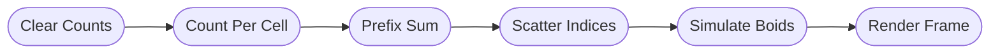

# Swarm


**[▶ Live Demo](https://neovand.github.io/swarm/)**

A high-performance boids flocking simulation running entirely on the GPU using WebGPU. Watch thousands of autonomous agents exhibit emergent collective behavior—schooling, swarming, and flowing like starling murmurations.

## Features

- **Massive Scale** — Simulate 10,000+ boids at 60fps with smooth trails
- **GPU-Accelerated** — All physics and rendering runs in WebGPU compute shaders
- **Interactive Cursors** — Attract, repel, or create vortices with different cursor shapes
- **Exotic Boundaries** — Torus, Klein bottle, Möbius strip, projective plane topologies
- **Multiple Algorithms** — 5 neighbor-finding strategies with tunable parameters
- **Rich Visualization** — 7 color modes including speed, direction, density, and more
- **Media Capture** — Record videos or take screenshots directly from the app

## The Boids Algorithm

Each boid follows three simple rules that create complex emergent behavior:

1. **Alignment** — Steer toward the average heading of nearby flockmates
2. **Cohesion** — Move toward the center of mass of nearby flockmates
3. **Separation** — Avoid crowding neighbors (short-range repulsion)

These local interactions produce global patterns: schools of fish, flocks of birds, swarms of insects.

## Architecture

### Spatial Hashing

To efficiently find neighbors for thousands of boids, the simulation uses a uniform spatial grid:



This transforms O(n²) neighbor searches into O(n) operations.

### Algorithms

| Algorithm             | Description                                      |
| --------------------- | ------------------------------------------------ |
| **Smooth Metric**     | Metric neighbors with smooth kernels and jitter  |
| **Topological K-NN**  | K-nearest neighbors regardless of distance       |
| **Hash Free**         | Per-boid randomized grid offset (no seams)       |
| **Stochastic Sample** | Random neighbor sampling with distance weighting |
| **Density Adaptive**  | Adjusts behavior based on local density          |

### Boundary Topologies

| Boundary             | Description                                       |
| -------------------- | ------------------------------------------------- |
| **Plane**            | Bounded area with soft wall avoidance             |
| **Torus**            | Wraps both axes (like Pac-Man)                    |
| **Cylinder**         | Wraps on one axis, bounces on the other           |
| **Möbius Strip**     | Wraps with a twist—exit right, enter left flipped |
| **Klein Bottle**     | Double twist, non-orientable surface              |
| **Projective Plane** | Both axes twisted                                 |

### Color Modes

- **Direction** — Hue based on heading angle
- **Speed** — Velocity magnitude visualization
- **Neighbors** — Local density coloring
- **Density** — Spatial hash cell occupancy
- **Acceleration** — Force magnitude
- **Turning** — Angular velocity
- **None** — Solid color from palette

## Tech Stack

- **[SvelteKit](https://svelte.dev/)** — Framework & static site generation
- **[WebGPU](https://www.w3.org/TR/webgpu/)** — GPU compute & rendering
- **[WGSL](https://www.w3.org/TR/WGSL/)** — Shader language
- **[Tailwind CSS](https://tailwindcss.com/)** — Styling
- **[Driver.js](https://driverjs.com/)** — Guided tour

## Development

```bash
npm install      # Install dependencies
npm run dev      # Start dev server
npm run build    # Build for production
npm run preview  # Preview production build
```

## Browser Support

WebGPU required:

- Chrome/Edge 113+
- Safari 18+ (macOS Sequoia / iOS 18)
- Firefox (behind flag)

## License

MIT

---

_Inspired by Craig Reynolds' [original boids paper](https://www.red3d.com/cwr/boids/) (1987)_
