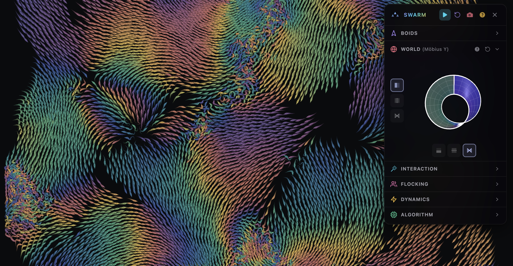

# Swarm




**[▶ Live Demo](https://neovand.github.io/swarm/)**

A high-performance boids flocking simulation running entirely on the GPU using WebGPU. Watch thousands of autonomous agents exhibit emergent collective behavior—schooling, swarming, and flowing like starling murmurations. Create predator-prey ecosystems with multiple species that hunt, flee, orbit, and interact in complex ways.

## Features

- **Multi-Species Simulation** — Up to 7 distinct species with unique behaviors and interactions
- **Predator-Prey Dynamics** — Configure pursuit, avoidance, attraction, mirroring, and orbital behaviors
- **Massive Scale** — Simulate 50,000+ boids at 60fps with smooth trails
- **GPU-Accelerated** — All physics, inter-species interactions, and rendering runs in WebGPU compute shaders
- **Per-Species Parameters** — Independent flocking rules, size, trails, and cursor responses per species
- **Interactive Cursors** — Attract, repel, or create vortices—each species can respond differently
- **Drawable Walls** — Paint obstacles that deflect boids in real-time
- **Exotic Boundaries** — Torus, Klein bottle, Möbius strip, projective plane topologies
- **Multiple Algorithms** — 5 neighbor-finding strategies with tunable parameters
- **Rich Visualization** — 8 color modes including species coloring, speed, direction, density, and more
- **Media Capture** — Record videos or take screenshots directly from the app

## The Boids Algorithm

Each boid follows three simple rules that create complex emergent behavior:

1. **Alignment** — Steer toward the average heading of nearby flockmates
2. **Cohesion** — Move toward the center of mass of nearby flockmates
3. **Separation** — Avoid crowding neighbors (short-range repulsion)

These local interactions produce global patterns: schools of fish, flocks of birds, swarms of insects.

## Multi-Species Simulation

Create rich ecosystems with up to 7 species, each with distinct visual identities (different head shapes) and fully independent parameters.

### Per-Species Parameters

Each species has its own tunable settings:

- **Flocking** — Alignment, cohesion, separation, and perception range
- **Appearance** — Size, trail length, head shape, and color (hue, saturation, lightness)
- **Behavior** — Rebel percentage (boids that ignore flocking rules)
- **Cursor Response** — Attract, repel, or ignore the cursor independently per species

### Inter-Species Interactions

Define how each species responds to others with 6 behavior types:

| Behavior    | Description                                           |
| ----------- | ----------------------------------------------------- |
| **Ignore**  | No interaction—species are invisible to each other    |
| **Avoid**   | Flee from the target species (prey behavior)          |
| **Pursue**  | Chase and hunt the target species (predator behavior) |
| **Attract** | Gentle attraction toward the target species           |
| **Mirror**  | Match the velocity/heading of nearby targets          |
| **Orbit**   | Circle around members of the target species           |

Each rule has configurable **strength** and **range** parameters. Rules can target specific species or "all others" for emergent multi-species dynamics.

### Example Ecosystems

- **Predator-Prey** — Small fish flee from sharks while sharks pursue them
- **Symbiosis** — Species A orbits species B while B is attracted to A
- **Territorial** — Multiple species that mutually avoid each other
- **Schooling** — Species that mirror and attract their own kind while ignoring others

## Architecture

### GPU Pipeline

The simulation runs entirely on the GPU using WebGPU compute shaders:


### Spatial Hashing

To efficiently find neighbors for thousands of boids, the simulation uses a uniform spatial grid. This transforms O(n²) neighbor searches into O(n) operations.

### Species System

Multi-species support is implemented efficiently on the GPU:

- **Species ID Buffer** — Each boid stores its species index
- **Species Parameters** — Uniform buffer with per-species flocking/visual settings
- **Interaction Matrix** — 7×7 matrix defining behavior rules between all species pairs
- **GPU-Side Evaluation** — All inter-species forces computed in parallel on the GPU

### Algorithms

| Algorithm             | Description                                      |
| --------------------- | ------------------------------------------------ |
| **Smooth Metric**     | Metric neighbors with smooth kernels and jitter  |
| **Topological K-NN**  | K-nearest neighbors regardless of distance       |
| **Hash Free**         | Per-boid randomized grid offset (no seams)       |
| **Stochastic Sample** | Random neighbor sampling with distance weighting |
| **Density Adaptive**  | Adjusts behavior based on local density          |

### Boundary Topologies

| Boundary             | Description                                       |
| -------------------- | ------------------------------------------------- |
| **Plane**            | Bounded area with soft wall avoidance             |
| **Torus**            | Wraps both axes (like Pac-Man)                    |
| **Cylinder**         | Wraps on one axis, bounces on the other           |
| **Möbius Strip**     | Wraps with a twist—exit right, enter left flipped |
| **Klein Bottle**     | Double twist, non-orientable surface              |
| **Projective Plane** | Both axes twisted                                 |

### Color Modes

- **Species** — Each species rendered in its custom color (hue/saturation/lightness)
- **Direction** — Hue based on heading angle
- **Speed** — Velocity magnitude visualization
- **Neighbors** — Local density coloring
- **Density** — Spatial hash cell occupancy
- **Acceleration** — Force magnitude
- **Turning** — Angular velocity
- **None** — Solid color from palette

## Keyboard Shortcuts

| Key     | Action                                  |
| ------- | --------------------------------------- |
| `Space` | Play/Pause simulation                   |
| `R`     | Reset boids                             |
| `N`     | Cycle through species                   |
| `1-4`   | Cursor modes (Off/Attract/Repel/Vortex) |
| `5-8`   | Wall tools (Toggle/Pencil/Eraser/Clear) |
| `Q/W`   | Decrease/Increase alignment             |
| `E/D`   | Decrease/Increase cohesion              |
| `Z/X`   | Decrease/Increase separation            |
| `C`     | Cycle color mode                        |
| `P`     | Cycle palette                           |
| `B`     | Cycle boundary topology                 |
| `A`     | Cycle algorithm                         |
| `+/-`   | Adjust population                       |
| `[/]`   | Adjust trail length                     |
| `↑/↓`   | Adjust speed                            |
| `←/→`   | Adjust boid size                        |
| `Tab`   | Toggle sidebar                          |
| `H`     | Start tour                              |

## Tech Stack

- **[SvelteKit](https://svelte.dev/)** — Framework & static site generation
- **[WebGPU](https://www.w3.org/TR/webgpu/)** — GPU compute & rendering
- **[WGSL](https://www.w3.org/TR/WGSL/)** — Shader language
- **[Tailwind CSS](https://tailwindcss.com/)** — Styling
- **[Driver.js](https://driverjs.com/)** — Guided tour

## Development

```bash
npm install      # Install dependencies
npm run dev      # Start dev server
npm run build    # Build for production
npm run preview  # Preview production build
```

## Browser Support

WebGPU required:

- Chrome/Edge 113+
- Safari 18+ (macOS Sequoia / iOS 18)
- Firefox (behind flag)

## License

MIT

---

_Inspired by Craig Reynolds' [original boids paper](https://www.red3d.com/cwr/boids/) (1987)_
